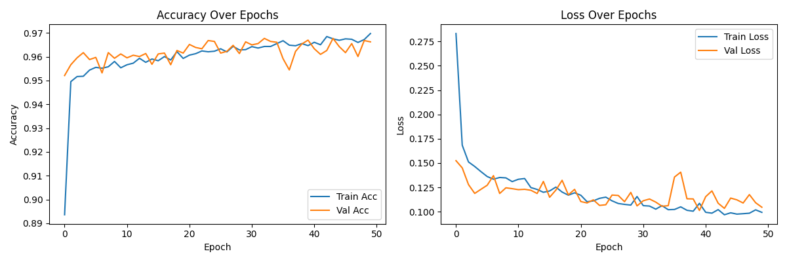
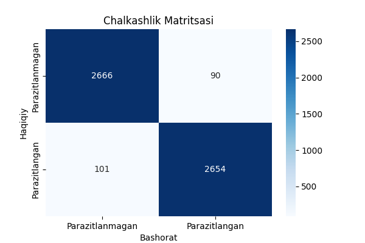
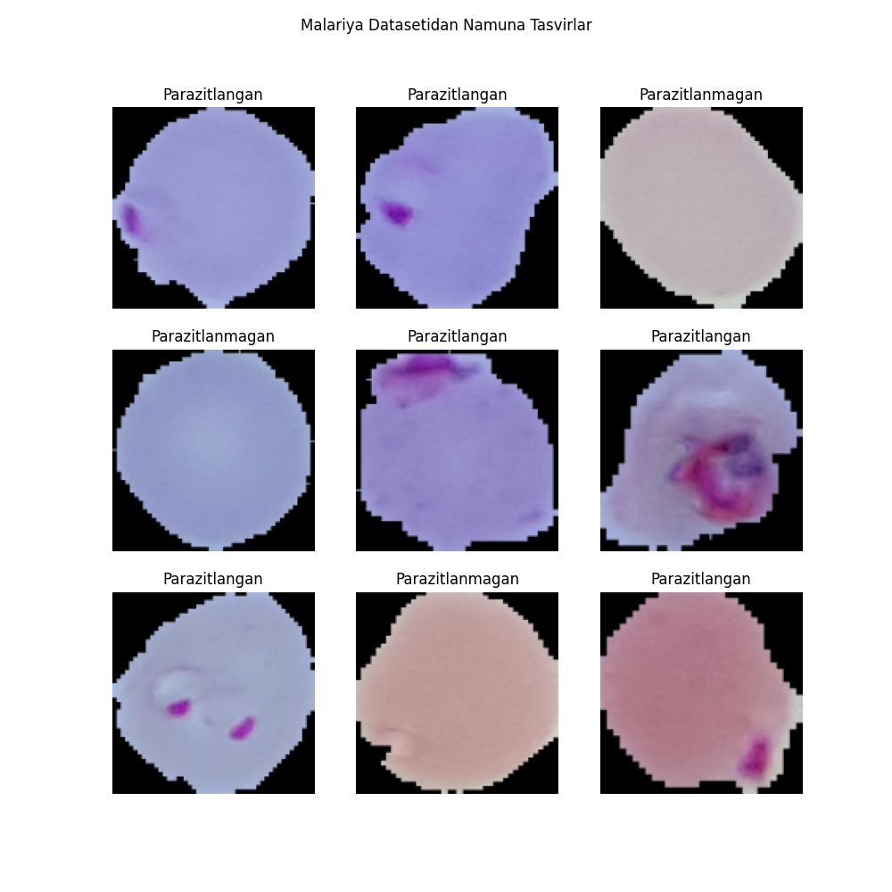
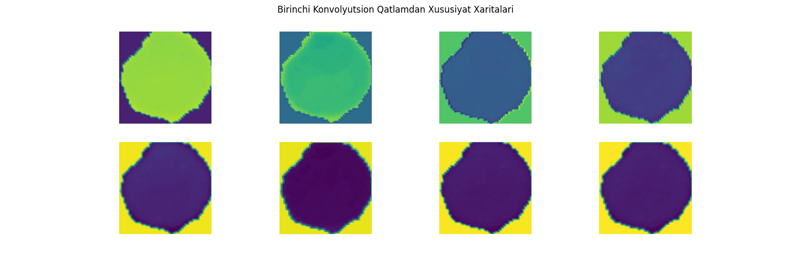
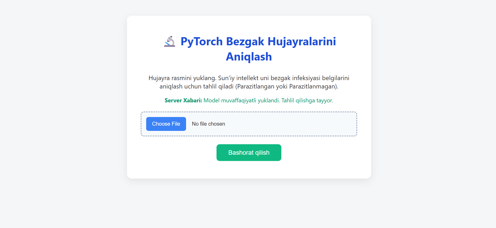
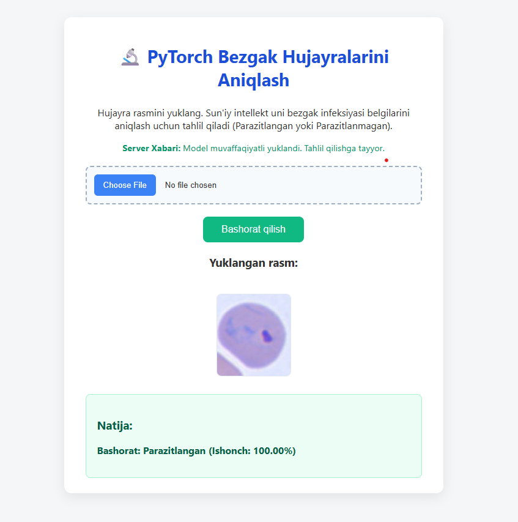
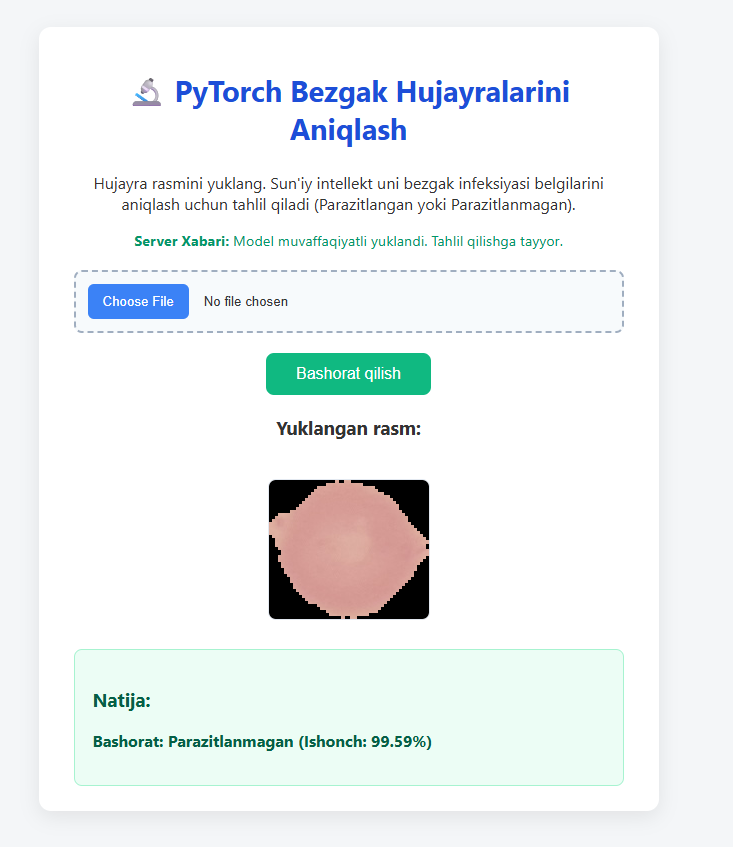

# Malaria Cell Image Classification using CNN

This project implements a Convolutional Neural Network (CNN) to classify malaria-infected cells from uninfected cells based on microscopic blood smear images. The primary implementation is done using PyTorch, with considerations for deployment using FastAPI.

## Table of Contents
- [Project Objective](#project-objective)
- [Dataset](#dataset)
- [Technologies Used](#technologies-used)
- [Project Structure](#project-structure)
- [Features](#features)
- [Setup and Installation](#setup-and-installation)
- [Usage](#usage)
  - [Training the Model](#training-the-model)
  - [Running the FastAPI Server (Deployment)](#running-the-fastapi-server-deployment)
- [Results](#results)
- [Ethical Considerations & Responsible AI](#ethical-considerations--responsible-ai)
- [BTEC Assignment Context](#btec-assignment-context)
- [Future Work](#future-work)
- [Author](#author)

## Project Objective
The main goal of this project is to develop an accurate and efficient deep learning model for the automated detection of malaria parasites in red blood cell images. This can aid in faster and more accessible diagnosis, particularly in resource-limited settings.

## Dataset
The project utilizes the "cell\_images" dataset, which contains segmented red blood cell images categorized into 'Parasitized' (infected) and 'Uninfected' classes. This dataset is commonly used for malaria detection research and is available from the NIH (National Institutes of Health).

* **Source**: (https://data.lhncbc.nlm.nih.gov/public/Malaria/cell_images.zip)
* **Classes**: Parasitized, Uninfected
* **Image Format**: PNG

## Technologies Used
* **Programming Language**: Python 3.x
* **Deep Learning Framework**: PyTorch (primary), TensorFlow (alternative version also explored)
* **Core Libraries**:
    * `torch`, `torchvision` (for PyTorch model, data loading, transforms)
    * `tensorflow`, `keras` (for TensorFlow version)
    * `opencv-python` (for image loading and preprocessing)
    * `numpy` (for numerical operations)
    * `matplotlib`, `seaborn` (for plotting and visualizations)
    * `scikit-learn` (for data splitting and evaluation metrics)
    * `Pillow` (PIL) (for image manipulation with torchvision)
* **Deployment (API)**: FastAPI, Uvicorn
* **Frontend (Simple UI)**: HTML, CSS, JavaScript

## Project Structure
A brief overview of the key files and directories:

## Features
* **CNN Model**: A custom CNN architecture designed for classifying cell images.
* **Data Preprocessing**: Includes image resizing, color space conversion (BGR to RGB), and normalization.
* **Data Augmentation**: Techniques like random rotations, flips, and resized crops are applied to the training set to improve model generalization and reduce overfitting.
* **Model Training**: Comprehensive training loop with validation, tracking accuracy and loss.
* **Model Evaluation**:
    * Quantitative metrics: Accuracy, Precision, Recall, F1-Score.
    * Visualizations: Confusion Matrix, Classification Report, Training/Validation Accuracy & Loss plots.
* **Feature Map Visualization**: Visualizing activations from convolutional layers to get insights into what the model learns.
* **API for Prediction**: A FastAPI backend (`main.py`) to serve the trained model (`malaria_model.pth`) and provide predictions via an API endpoint.
* **Simple Web Interface**: An `index.html` page allowing users to upload a cell image and receive a classification result from the API.

## Setup and Installation

1.  **Prerequisites**:
    * Python (version 3.7+ recommended)
    * `pip` package installer

2.  **Clone the Repository**:
    ```bash
    git clone [https://github.com/UlashovaZaxro/Malaria.git](https://github.com/UlashovaZaxro/Malaria.git)
    cd Malaria
    ```

3.  **Create and Activate a Virtual Environment** (recommended):
    ```bash
    python -m venv venv
    # On Windows
    venv\Scripts\activate
    # On macOS/Linux
    source venv/bin/activate
    ```

4.  **Install Dependencies**:
    ```bash
    pip install -r requirements.txt
    ```
    *Note: If `requirements.txt` is not exhaustive, you might need to install libraries like `torch`, `torchvision`, `opencv-python`, `fastapi`, `uvicorn`, etc., manually or based on import errors.*

5.  **Download Dataset**:
    * Ensure the `cell_images` dataset is present in the project's root directory or update the `data_dir` variable in the scripts/notebooks to point to its location.

## Usage

### Training the Model
1.  Open and run the `pytorch.ipynb` Jupyter Notebook.
2.  The notebook contains cells for data loading, preprocessing, model definition, training, and evaluation.
3.  The trained model (state dictionary) will be saved as `malaria_model.pth`.
4.  Generated plots (training history, confusion matrix, etc.) will be saved in the `images/` directory (or as specified in the notebook).

### Running the FastAPI Server (Deployment)
This allows you to make predictions using the trained model via an API.

1.  **Ensure `malaria_model.pth` is present** in the project directory (or update the path in `main.py`).
2.  **Start the FastAPI server** using Uvicorn:
    ```bash
    uvicorn main:app --reload
    ```
    *(Remove `--reload` for production)*
3.  The API will typically be available at `http://127.0.0.1:8000`.
4.  You can access the API documentation (Swagger UI) at `http://127.0.0.1:8000/docs`.

5.  **Access the Web Interface**:
    * Open the `templates/index.html` file in your web browser.
    * Alternatively, if your FastAPI app is configured to serve static files, you might access it via the server URL (e.g., `http://127.0.0.1:8000/`).
    * Use the interface to upload a cell image and get a prediction from the running FastAPI backend. *Ensure the JavaScript in `index.html` points to the correct API endpoint.*

## Results
The PyTorch CNN model achieved an accuracy of approximately **[Your Test Accuracy, e.g., 94-95%]** on the test set. Detailed performance metrics (Precision, Recall, F1-score) and visualizations like the confusion matrix and training history plots can be found in the `pytorch.ipynb` notebook and the `images/` folder.
*(You should replace the bracketed part with your actual achieved accuracy.)*

## Ethical Considerations & Responsible AI
This project, dealing with medical diagnostic assistance, inherently involves ethical responsibilities. Key considerations include:
* **Patient Safety**: Ensuring model accuracy and reliability to prevent harm from misdiagnosis.
* **Fairness and Bias**: Addressing potential biases in the `cell_images` dataset to ensure equitable performance across different demographics.
* **Transparency and Explainability**: Striving for understandable model decisions, beyond basic feature map visualizations.
* **Data Privacy**: Protecting the confidentiality of sensitive medical image data.
* **Accountability**: Defining responsibility for model outcomes in a clinical setting.
* **Human Oversight**: Emphasizing that this AI model is a tool to assist medical professionals, not replace them.

These aspects were analyzed as part of the BTEC HNC in Digital Technologies, Unit 15 assignment.

## BTEC Assignment Context
This project was developed in partial fulfillment of the Pearson BTEC Level 4 Higher National Certificate in Digital Technologies, specifically for **Unit 15: Fundamentals of Artificial Intelligence (AI) and Intelligent Systems**. It addresses learning outcomes related to:
* LO1: Theoretical foundations of AI and ML.
* LO2: Approaches, techniques, and tools of ML-driven Intelligent Systems.
* LO3: Modifying an ML-based system for a real-world problem.
* LO4: Evaluating technical and ethical challenges and opportunities of ML-based Intelligent Systems.

The project covers criteria such as CNN fundamentals (A.P1), image preprocessing (A.P2), CNN architecture investigation (B.P3), framework comparison (B.P4), model building/training/evaluation workflow (B.M2, B.D1, C.P5, C.P6, C.P7), deployment considerations (C.M3, D.M4), and ethical analysis (D.P8, D.P9, D.D3).

## Future Work
* Explore more advanced CNN architectures (e.g., ResNet, DenseNet) or transfer learning.
* Implement more sophisticated XAI techniques (e.g., Grad-CAM, SHAP) for better model interpretability.
* Develop a more robust and user-friendly web application for deployment.
* Expand the dataset to improve generalization and reduce bias.
* Investigate federated learning for privacy-preserving model training.

## Author
* **Ulashova Zaxro**
    * GitHub: [UlashovaZaxro](https://github.com/UlashovaZaxro)

## Results & Visualizations 📊

The PyTorch CNN model achieved an accuracy of approximately **[Your Test Accuracy, e.g., 94-95%]** on the test set. Detailed performance metrics (Precision, Recall, F1-score) and visualizations can be found in the `pytorch.ipynb` notebook.

Here are some key visualizations from the model training and evaluation:

### Training History
This plot shows the model's accuracy and loss progression over epochs for both training and validation sets.


### Confusion Matrix
The confusion matrix provides a detailed breakdown of classification performance for each class (Parasitized vs. Uninfected) on the test set.


### Sample Images from Dataset
A few examples of 'Parasitized' and 'Uninfected' cell images from the dataset used for training.


### Feature Maps
Visualization of feature maps from the first convolutional layer, offering some insight into the initial features learned by the model.



## Deployment & Web Application Interface 🚀🌐

The trained PyTorch model (`malaria_model.pth`) is served via a FastAPI backend (`main.py`). A simple HTML, CSS, and JavaScript frontend (`templates/index.html`) allows users to interact with the deployed model. Users can upload a cell image, and the system will predict whether the cell is 'Parasitized' or 'Uninfected'.

Below are screenshots demonstrating the web application's workflow:

**1. Web Application Interface (Initial View):**
The application interface when it's ready for an image upload. The server message indicates the model is loaded.

*Caption: The main user interface for the Malaria Cell Classification application, ready for file upload.*

**2. Prediction for a Parasitized Cell:**
An image of a parasitized cell is uploaded, and the model correctly classifies it with high confidence.

*Caption: Example of a prediction result showing a "Parasitized" cell.*

**3. Prediction for an Uninfected Cell:**
An image of an uninfected cell is uploaded, and the model correctly classifies it with high confidence.


*Caption: Example of a prediction result showing an "Uninfected" cell.*

To run this locally:
1. Start the FastAPI server: `uvicorn main:app --reload`
2. Open the `templates/index.html` file in your browser.
*(Further deployment instructions for platforms like PythonAnywhere, Heroku, or Google Cloud Run can be detailed here or linked to a separate deployment guide.)*